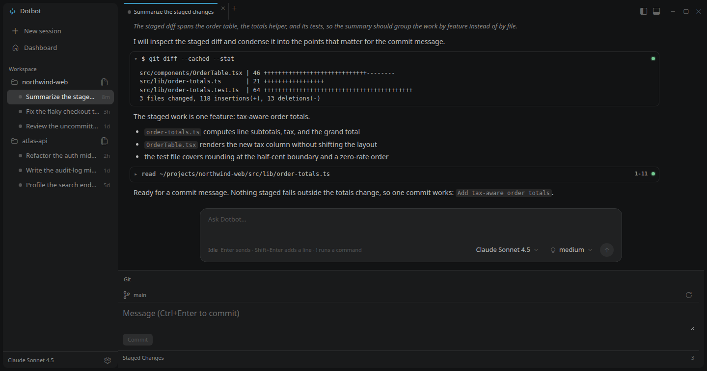
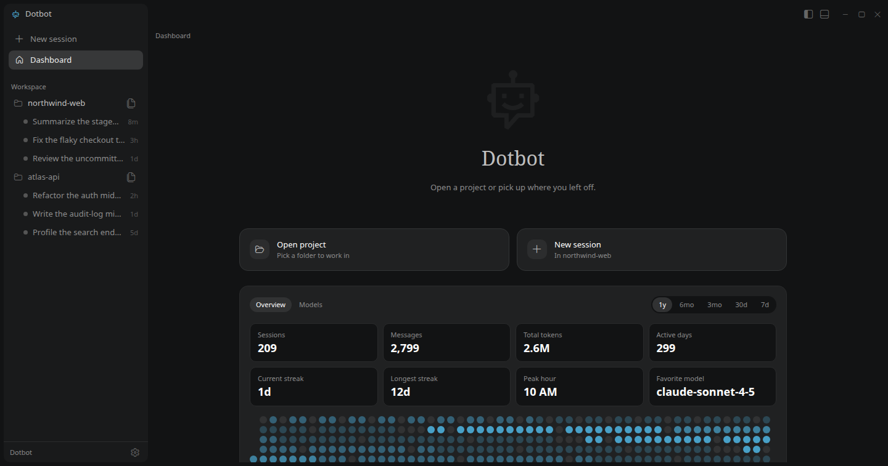
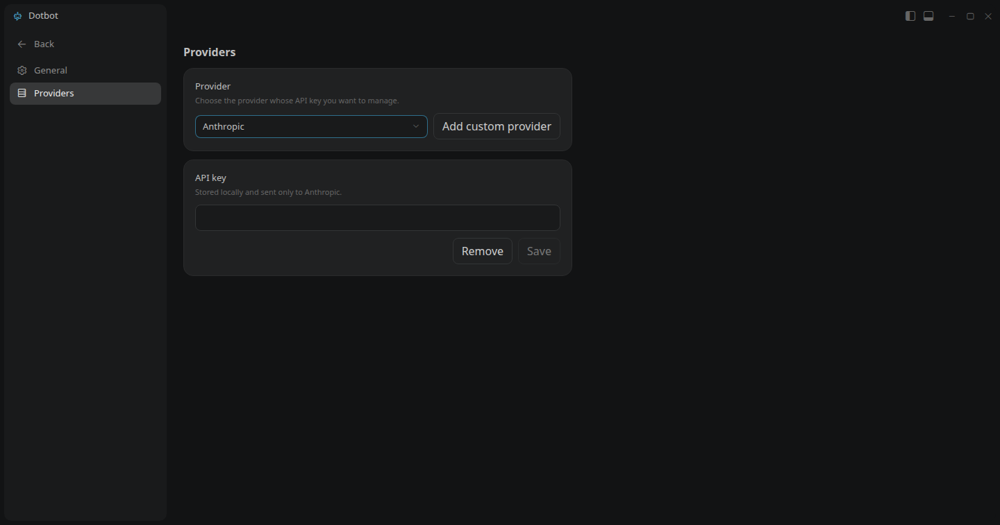

# Dotbot

Dotbot is a desktop app for coding-agent sessions. Open the projects you work
in, run a session for each piece of work, and review the code, files, and Git
state in one window. The agent runtime runs inside the app process, so there is
no separate service to start.



## Features

- **Projects and sessions**: open any folder as a project and keep one session
  per piece of work. Sessions persist between runs; opening one reloads its
  transcript.
- **Live session transcripts**: streamed answers, inline thinking, collapsible
  tool cards with diffs and file previews, and steer or follow-up messages while
  a turn is running.
- **Model control**: pick the model and thinking level per session, and stop a
  running turn at any time.
- **Dashboard**: usage statistics computed from your session history, including
  messages, tokens, active days, streaks, peak hour, a daily heatmap, and a
  model breakdown.
- **Files and Git**: browse the project tree from the sidebar and watch changes
  appear as they happen. The Git panel stages, unstages, and commits.
- **Providers**: save an API key for a built-in provider such as Anthropic,
  OpenAI, or Google, or add a custom provider for OpenAI Completions or
  Responses, Anthropic Messages, or Google Generative AI.
- **Project trust**: decide whether the agent may use a project's local
  resources, such as its settings, extensions, skills, prompts, or themes.
  Dotbot asks when a project has them, remembers the answer, and falls back to a
  global default set in **Manage → General**.
- **Bash mode**: type `!command` in the composer to add shell output to the
  model's context, or `!!command` to keep it out.

| Dashboard | Providers |
|:---:|:---:|
|  |  |

## Install

Download the latest release from the
[Releases page](https://github.com/aaditri-globaltech/dotbot/releases):

- **Linux**: AppImage (runs anywhere) or `.deb` package.
- **Windows**: installer.
- **macOS**: `.dmg` for Apple silicon or Intel.

Or run from source with Node 24 or newer:

```sh
npm install --ignore-scripts
npm run prepare   # install the Git hooks
npm run patch     # brand the embedded agent runtime
npm run dev
```

`prepare` and `patch` run automatically during a plain `npm install`.

Release builds are unsigned; macOS and Windows may show a security warning on
first launch.

## First run

1. Open a project from the Dashboard or the sidebar folder action.
2. Add a provider API key in **Manage → Providers**.
3. Start a session and send a prompt.

Settings, credentials, and sessions live in `~/.bot/agent`
(`%USERPROFILE%\.bot\agent` on Windows). API keys are stored there as plain
text. Git is optional and only needed for the Git panel; install it and put it
on `PATH` to use it.

## Keyboard shortcuts

| Shortcut | Action |
| --- | --- |
| `Enter` | Send a prompt |
| `Shift+Enter` | Insert a newline |
| `Ctrl+Enter` | Commit in the Git panel |
| Arrow keys | Resize the sidebar or bottom panel when its edge has focus |
| `Esc` | Close a menu or dialog |

## Development

See [CONTRIBUTING.md](CONTRIBUTING.md) for setup, validation, and pull request
rules. Run the formatter, linter, and type checker with `npm run check`, and the
tests with `npm test`.

## Documentation

- [GLOSSARY.md](GLOSSARY.md) — every term Dotbot uses and what it means here.
- [app/README.md](app/README.md) — the Electron client and its renderer.
- [docs/superpowers](docs/superpowers) — design documents for larger changes.

## License

[Apache-2.0](LICENSE)
